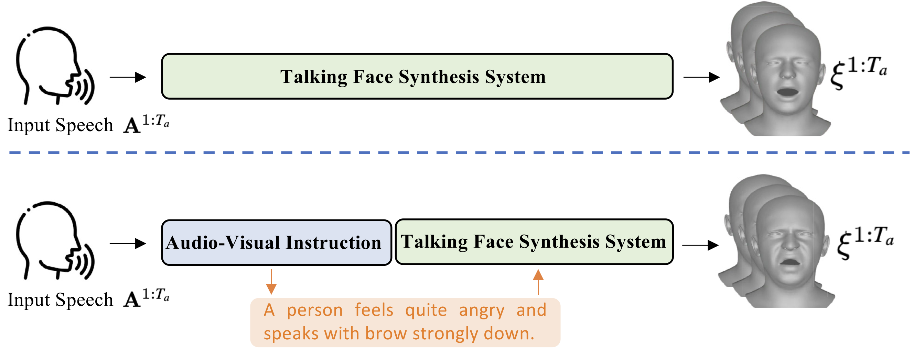
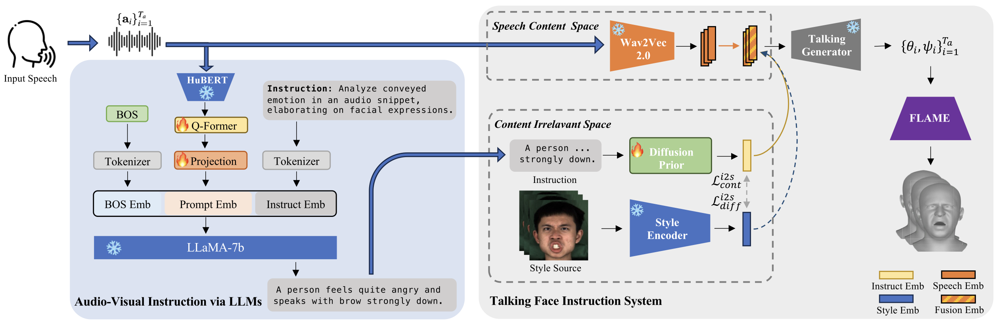

# AVI-Talking: Learning Audio-Visual Instructions for Expressive 3D Talking Face Generation
[Yasheng Sun](https://scholar.google.com/citations?user=Vrq1yOEAAAAJ&hl=en), [Wenqing Chu](https://scholar.google.com/citations?hl=en&user=1Ae0CMgAAAAJ), [Zhiliang Xu](https://scholar.google.com/citations?user=93ZNjNgAAAAJ&hl=en), [Dongliang He](https://scholar.google.com/citations?hl=en&user=ui6DYGoAAAAJ), [Hideki Koike](https://scholar.google.com/citations?user=Ih8cJXQAAAAJ&hl=en)



### [Paper](https://ieeexplore.ieee.org/abstract/document/10504116)
Our goal is to directly leverage the inherent style information conveyed by human speech for generating an expressive talking face that aligns with the speaking status. In this paper, we propose AVI-Talking, an Audio-Visual Instruction system for expressive Talking face generation.




# Table of Content
- [News](#news)
- [Installation](#step-by-step-installation-instructions)
- [Pretrained Model](#pretrained-model)
- [Testing](#testing)
- [Training](#training)
- [License](#license)
- [Acknowledgements](#acknowledgements)


# News
- [2024/02]: Paper is on [Arxiv](https://arxiv.org/abs/2402.16124).
- [2024/04]: Paper is accepted by [IEEE Access](https://ieeexplore.ieee.org/abstract/document/10504116).


# Step-by-step Installation Instructions

**a. Create a conda virtual environment and activate it.**
It requires python >= 3.8 as base environment.
```shell
conda create -n sssp python=3.8 -y
conda activate sssp
```

**b. Install PyTorch and torchvision following the [official instructions](https://pytorch.org/).**
```shell
conda install pytorch==1.9.0 torchvision==0.10.0 -c pytorch -c conda-forge
```

**b. Install other dependencies.**
We simply freeze our environments. Other environments might also works. Here we provide requirements.txt file for reference.
```shell
pip install -r requirements.txt
```


# Pretrained Model
- Download the pre-trained [model](https://1drv.ms/f/c/7c0cd8158f160d40/EvrKJUDg3vJOlrKYGCGnW1gBHb1BY6ooSCS2EVqet5Zslw?e=wpYHSB) and put it to `train_logs/` accordingly.  

# Instructions for Testing the Model

Once the pre-trained model is prepared, you can test the model by running the following command:
```bash
bash experiments/diffusion_test.sh align_emote
```

# Instructions for Training the Model
If you are interested in training the model by yourself, please set up the environments accordingly and run the below commands. 
```bash
bash experiments/diffusion_train.sh align_emote
```


# Acknowledgements

**Many thanks to these excellent open source projects:**
- [DALLE2-pytorch] (https://github.com/lucidrains/DALLE2-pytorch)
- [INFERNO] (https://github.com/radekd91/inferno)
- [PIRender] (https://github.com/RenYurui/PIRender)
- [PD-FGC-inference] (https://github.com/Dorniwang/PD-FGC-inference)


# Citation
If you find our paper and code useful for your research, please consider citing:
```bibtex
@article{sun2024avi,
  title={AVI-Talking: Learning Audio-Visual Instructions for Expressive 3D Talking Face Generation},
  author={Sun, Yasheng and Chu, Wenqing and Zhou, Hang and Wang, Kaisiyuan and Koike, Hideki},
  journal={IEEE Access},
  year={2024},
  publisher={IEEE}
}
```